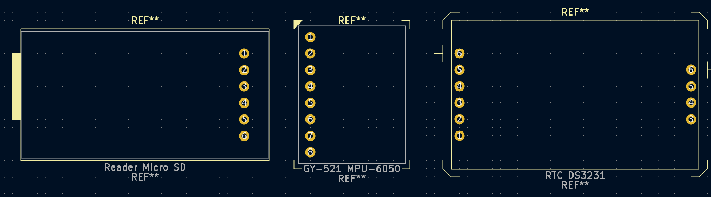

# KiCAD-AZDelivery
A Library of Footprints and Symbols of [AZ-Delivery](https://www.azde.ly/) Components for [KiCAD](https://www.kicad.org/).

[List of included components](./COMPONENTS.md).

## How to install
1. Download this repository as a [.zip file](https://github.com/nkappler/KiCAD-AZDelivery/archive/refs/heads/main.zip) and extract it.
2. In the **Symbol Library Table** (Preferences → Manage Symbol Libraries…) choose **add existing library to table** (folder icon) and select the `AZDelivery.kicad_sym` file.
3. Repeat step 2 for the **Footprint Library Table** (Preferences → Manage Footprint Libraries…), this time selecting `AZDelivery.pretty` directory.

## Why this library exists
If you are trying to buy electronic components for prototyping in Germany, you'll quickly come across AZ-Delivery.
They are based in Germany so often times they'll be the cheapest provider with quick shipping.
Unfortunately their provided documentation could be better and doesn't include Libraries for any CAD software.

## Disclaimer
I try to create the footprints as precise as possible, but I experienced that sometimes the measurements on the website or
in the article description (if there is any) can be off by up to 0.2mm so keep this in mind when designing PCBs.
This only affects the outline of the part, not the pin/through-hole placement. I'll include a little space around the outline in
the footprint to compensate the inaccuracies.

If possible, compare your physical board with the footprint. I am not associated with AZ-Delivery, so a footprint could be
out of date without me knowing. If you notice something wrong, please file an issue or create a pull request.

## Contributing
If you want to add a missing component to this library, feel free to create a pull request. If you can't create
the footprints and symbols yourself, file an issue asking for help.
When designing footprints, please follow these best practices:
- Keep the inaccuracies mentioned above in mind,
- Add some sort of pin indicator to the silkscreen to make the board placement unambiguous.
  See other boards for reference if unsure about this.
- Don't forget to also update the [list of included components](./COMPONENTS.md).
